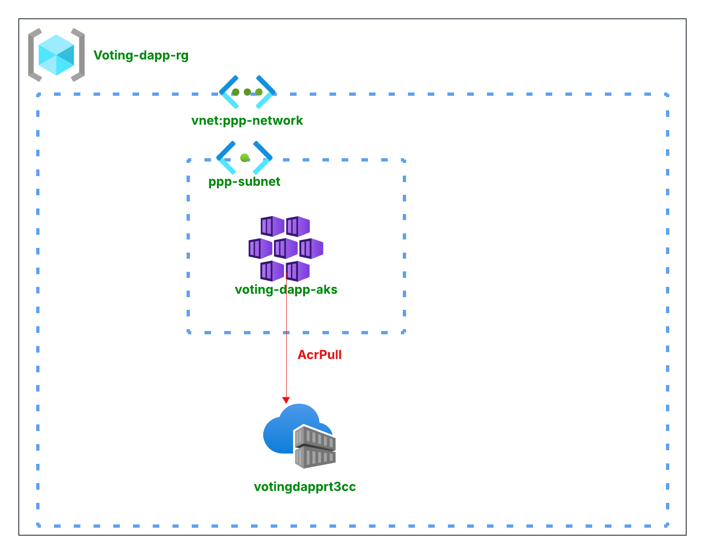
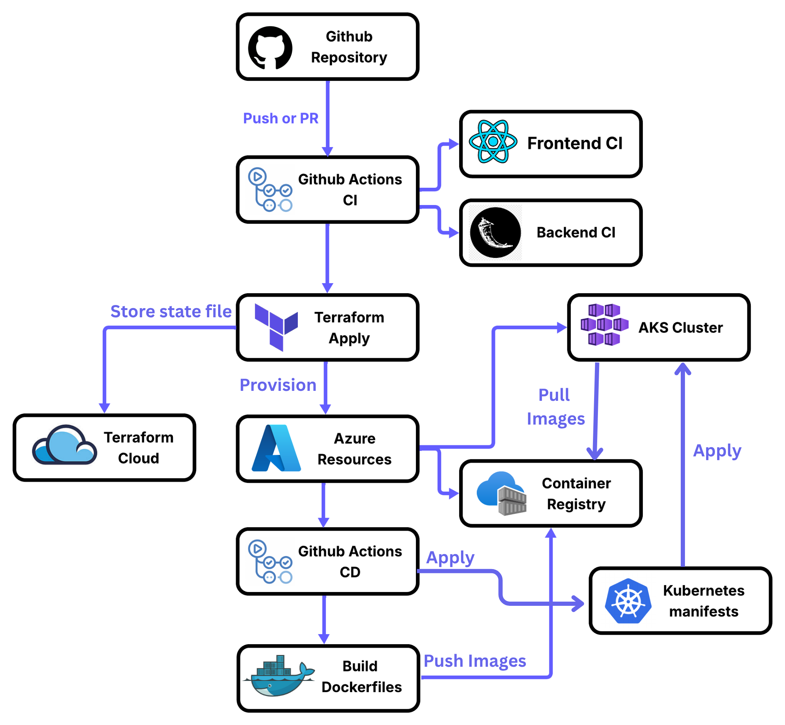

# Blockachain 


# Devops Workflow


[](https://www.docker.com)
[](https://kubernetes.io)
[](https://azure.microsoft.com)
[](https://www.terraform.io)
[](https://github.com/features/actions)

This section describes the complete DevOps pipeline used to build, test, provision, and deploy this application to Azure using tools like Docker, GitHub Actions, Terraform, and Kubernetes.

<h1 style="font-weight: bold; font-size: 1.5em; border-bottom: none !important; padding-bottom: 0 !important; margin-bottom: 0 !important;">🐳 Dockerization</h1> 

The project consists of:
- A React frontend
- A Flask backend
- A PostgreSQL database

All services are containerized using individual Dockerfiles and can be tested locally using Docker Compose. 
``` bash
docker compose up --build
```

- The backend connects to PostgreSQL using environment variables (DATABASE_URL)

- The frontend communicates with the backend via the defined API URL

Used for local development and validation before deployment.

<hr>
<br>
<h1 style="font-weight: bold; font-size: 1.5em; border-bottom: none !important; padding-bottom: 0 !important; margin-bottom: 0 !important;"> Continuous Integration Pipelines</h1> 
We have two GitHub Actions CI pipelines, one for each component:

- **Frontend CI** (.github/workflows/frontend-ci.yml)
<br>Runs on pushes and PRs to main affecting the frontend/ directory.
    - Set up Node.js
    - Installs dependencies (npm ci)
    - Builds the React app
    - Run unit tests (CandidatesPage.test.js)

- **Backend CI** (.github/workflows/backend-ci.yml) <br>
Runs on changes to the backend/ directory or the backend workflow file.
    - Set up Python and dependencies
    - Runs unit tests with pytest
    - Check if the Flask app starts correctly

Each pipeline ensures code quality and consistency before building Docker images or deploying to production.
<hr>
<br>
<h1 style="font-weight: bold; font-size: 1.5em; border-bottom: none !important; padding-bottom: 0 !important; margin-bottom: 0 !important;"> Infrastructure Provisioning with Terraform</h1> 
We use Terraform to provision infrastructure on Microsoft Azure, with Terraform Cloud used for remote backend and collaborative state management.<br>
The following resources are created:

- **Azure Resource Group**: container for all infrastructure resources.
- **Virtual Network**: isolated network environment with a defined IP space.
- **Subnet**: subdivision of the virtual network for Kubernetes nodes.
- **Azure Kubernetes Service (AKS)**: managed Kubernetes cluster with 2 nodes for app deployment.
- **Azure Container Registry (ACR)**: private Docker image registry for AKS.
- **Role Assignment**: grants AKS permission to pull images from ACR.

``` bash
terraform init
terraform plan
terraform apply
```

☁️ Terraform Cloud as Remote Backend (backend.tf)
- The state file contains sensitive data. Storing it remotely in Terraform Cloud avoids exposing it in the Git repository.
- Terraform Cloud ensures only one terraform apply runs at a time by locking the state file. This prevents concurrent changes that could corrupt or conflict the infrastructure.
- All changes and history are tracked per workspace, which makes it easy to manage infrastructure as a team.



<hr>

<h1 style="font-weight: bold; font-size: 1.5em; border-bottom: none !important; padding-bottom: 0 !important; margin-bottom: 0 !important;">  Kubernetes Manifests
</h1> 
Kubernetes manifests define the desired state of the deployed application. They are located in the k8s/ directory and include:

- **Deployments**
    - frontend-deployment.yaml
    - backend-deployment.yaml
    - postgres-deployment.yaml

- **Services**
    - frontend-service.yaml (LoadBalancer)
    - backend-service.yaml (LoadBalancer)
    - postgres-service.yaml (ClusterIP)

- **Secrets** 
    - Sensitive information are managed securely using Kubernetes Secrets. These secrets are created automatically during deployment (kubectl create secret) by GitHub Actions, which pulls the secret values stored in the repository’s GitHub Actions secrets.
    - For the backend service, important secrets like the **database url** and **JWT key** are injected into the deployment using Kubernetes secretKeyRef mechanism, allowing the application to access them as environment variables without exposing them in the code.
    - Similarly, for the PostgreSQL database deployment, the **username**, **password**, and **database name** are provided via Kubernetes secrets to ensure credentials remain confidential and are only accessible to the database pod.

- **Namespace**
    - All resources are deployed into a custom namespace (voting-dapp) for isolation and better organization.

 TODO: Add Ingress Controller & Ingress manifests 

<hr>
<br>

<h1 style="font-weight: bold; font-size: 1.5em; border-bottom: none !important; padding-bottom: 0 !important; margin-bottom: 0 !important;"> Continuous Deployment Pipeline
</h1> 
A single CD pipeline (deploy.yml) handles:

- Docker login to ACR
- Build and push frontend & backend images
- Fetch AKS credentials
- Create secrets using kubectl
- Apply Kubernetes manifests

<br>




