# Blockachain 


# Devops Workflow


[](https://www.docker.com)
[](https://kubernetes.io)
[](https://azure.microsoft.com)
[](https://www.terraform.io)
[](https://github.com/features/actions)

This section describes the complete DevOps pipeline used to build, test, provision, and deploy this application to Azure using tools like Docker, GitHub Actions, Terraform, and Kubernetes.

<h1 style="font-weight: bold; font-size: 1.5em; border-bottom: none !important; padding-bottom: 0 !important; margin-bottom: 0 !important;">🐳 Dockerization</h1> 

The project consists of:
- A React frontend
- A Flask backend
- A PostgreSQL database

All services are containerized using individual Dockerfiles and can be tested locally using Docker Compose. 
``` bash
docker compose up --build
```

- The backend connects to PostgreSQL using environment variables (DATABASE_URL)

- The frontend communicates with the backend via the defined API URL

Used for local development and validation before deployment.

<hr>
<br>
<h1 style="font-weight: bold; font-size: 1.5em; border-bottom: none !important; padding-bottom: 0 !important; margin-bottom: 0 !important;">🔄 Continuous Integration Pipelines</h1> 
We have two GitHub Actions CI pipelines, one for each component:

- Frontend CI (.github/workflows/frontend-ci.yml)
Runs on every push to main (or PR)
    - Installs dependencies
    - Builds the React app

- Backend CI (.github/workflows/backend-ci.yml)
    - Runs on every push to main (or PR)
    - Installs dependencies
    - Runs unit tests
    - Validates the backend using pytest

Each pipeline ensures code quality and consistency before building Docker images or deploying to production.
<hr>
<br>
<h1 style="font-weight: bold; font-size: 1.5em; border-bottom: none !important; padding-bottom: 0 !important; margin-bottom: 0 !important;">🏗️ Infrastructure Provisioning with Terraform</h1> 
Infrastructure is provisioned on Microsoft Azure using Terraform. The following resources are created:

- Azure Resource Group
- Azure Kubernetes Service (AKS) with 2 nodes
- Azure Container Registry (ACR)

☁️ Terraform Cloud
Remote backend is stored on Terraform Cloud for safe and collaborative state management.

- zid ahki ala terraform cloud belgda 

``` bash
terraform init
terraform plan
terraform apply
```

<hr>
<br>

<h1 style="font-weight: bold; font-size: 1.5em; border-bottom: none !important; padding-bottom: 0 !important; margin-bottom: 0 !important;">☸️ Kubernetes Manifests
</h1> 
Kubernetes manifests define the desired state of the deployed application. They are located in the k8s/ directory and include:

- **Deployments**
    - frontend-deployment.yaml
    - backend-deployment.yaml
    - postgres-deployment.yaml

- **Services**
    - frontend-service.yaml (LoadBalancer)
    - backend-service.yaml (LoadBalancer)
    - postgres-service.yaml (ClusterIP)

- **Secrets** 
    - Secrets are created from GitHub Actions secrets during deployment (kubectl create secret)
    - Database and JWT keys are injected using envFrom.secretKeyRef
    - TODO: add details

- **Namespace**
    - All resources are deployed into a custom namespace (voting-dapp) for isolation and better organization.

 TODO: Add Ingress Controller & Ingress manifests 

<hr>
<br>

<h1 style="font-weight: bold; font-size: 1.5em; border-bottom: none !important; padding-bottom: 0 !important; margin-bottom: 0 !important;">🚀 Continuous Deployment Pipeline
</h1> 
A single CD pipeline (deploy.yml) handles:

- Docker login to ACR
- Build and push frontend & backend images
- Fetch AKS credentials
- Create secrets using kubectl
- Apply Kubernetes manifests

## TODO: Graph with mermaids

```mermaid
%%{ 
  init: { 
    "theme": "default", 
    "themeVariables": { 
      "fontSize": "20px", 
      "nodePadding": "50", 
      "edgeLabelBackground":"#ffffff" 
    } 
  } 
}%%

graph TD
    classDef default minWidth:300px

    %% Trigger
    T["📥 GitHub Push to main"] --> CI["🔁 GitHub Actions CI"]
    CI --> Test["🧪 Run Tests (Backend/Frontend)"]
    Test --> CD["🚀 GitHub Actions CD"]

    %% Terraform Infrastructure
    CD --> TF["🏗️ Terraform Apply"]
    TF -->|Provisions| AKS["☁️ Azure AKS Cluster"]
    TF --> ACR["📦 Azure Container Registry"]

    %% Docker Build & Push
    CD --> Build["🐳 Docker Build Images"]
    Build --> Push["📤 Push Images to ACR"]

    %% K8s Deploy
    Push --> K8S["☸️ kubectl apply (K8s Manifests)"]
    K8S --> Secrets["🔐 Create Secrets"]
    Secrets --> DB["🗄️ Deploy PostgreSQL"]
    K8S --> BE["⚙️ Deploy Backend"]
    K8S --> FE["🖥️ Deploy Frontend"]

    %% App Flow
    FE -->|API Calls| BE
    BE -->|DB Queries| DB
    FE --> User["✅ Users Access the App"]

    %% Styling

    classDef trigger fill:#fff7e6,stroke:#ffa500,color:#000;
    classDef ci fill:#e6f7ff,stroke:#1890ff,color:#000;
    classDef infra fill:#e6fffb,stroke:#13c2c2,color:#000;
    classDef docker fill:#f9f0ff,stroke:#9254de,color:#000;
    classDef k8s fill:#f6ffed,stroke:#52c41a,color:#000;
    classDef app fill:#fff0f6,stroke:#eb2f96,color:#000;
    classDef user fill:#fffbe6,stroke:#fadb14,color:#000;

    class T trigger;
    class CI,Test,CD ci;
    class TF,AKS,ACR infra;
    class Build,Push docker;
    class K8S,Secrets,DB,BE,FE k8s;
    class User user;


```



   
   

